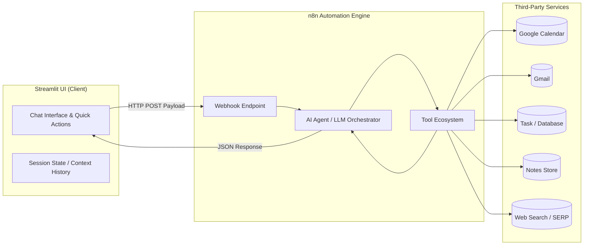

# 🤝 AI Personal Assistant (Suraj-PA)

[](https://python.org)
[](https://streamlit.io)
[](https://n8n.io)
[](LICENSE)

An intelligent, modular **AI-powered Personal Productivity Assistant** built with **Streamlit** and powered by **n8n workflow automation**. Seamlessly orchestrate daily schedules, emails, tasks, notes, expense tracking, and web queries through an intuitive conversational chat interface.

---

## 🌟 Key Features

| Capability | Icon | Description |
| :--- | :---: | :--- |
| **Google Calendar** | 📅 | Create schedule events, check daily agendas, and manage meetings. |
| **Gmail Management** | ✉️ | Read, summarize unread emails, compose drafts, send, and reply to messages. |
| **Task Management** | ✅ | Create, view, update, and manage your to-do list effortlessly. |
| **Smart Notes** | 📝 | Capture thoughts, create meeting notes, and retrieve information quickly. |
| **Expense Tracker** | 💰 | Log daily expenses (e.g., in NPR/USD), categorize costs, and calculate totals. |
| **Web & Info Search** | 🔎 | Ask complex questions, retrieve real-time facts, and summarize information. |

---

## 🏗️ Architecture Overview

The system utilizes a decoupled client-agent architecture:



1. **User Interaction**: Users interact via dynamic chat or predefined one-click Quick Action buttons.
2. **Webhook Dispatch**: The client serializes the conversation history and dispatches a JSON payload to the n8n webhook (`http://localhost:5678/webhook/...`).
3. **Autonomous Agent Execution**: The n8n AI Agent processes intent, triggers respective tools/APIs (Calendar, Gmail, Notes, etc.), and synthesizes structured output.
4. **Response Rendering**: Streamlit dynamically formats and renders markdown, code blocks, and system alerts with resilient error handling.

---

## 📦 Project Structure

```text
Personal Assistant/
├── app.py              # Streamlit frontend application with custom CSS & chat UI
├── main.py             # Entrypoint script
├── test_webhook.py     # Standalone script to test & verify n8n webhook responses
├── pyproject.toml      # Project configuration and dependency metadata (PEP 621)
├── uv.lock             # Deterministic lockfile for uv package manager
└── README.md           # Project documentation
```

---

## 🚀 Getting Started

### 1. Prerequisites

- **Python 3.12+**
- **uv** (recommended) or **pip**
- **n8n instance** running locally (`http://localhost:5678`) or self-hosted in the cloud

### 2. Installation

Clone the repository and install dependencies:

```bash
# Clone the repository
git clone https://github.com/surajpoddar-ml/Ai-Personal-Assistant.git
cd "Personal Assistant"

# Install dependencies using uv (recommended)
uv sync

# Or install dependencies using pip
pip install -e .
```

### 3. Configure the Webhook Endpoint

Open `app.py` (and `test_webhook.py`) and update the `WEBHOOK_URL` variable with your active n8n webhook URL:

```python
WEBHOOK_URL = "http://localhost:5678/webhook/your-webhook-id-here"
```

---

## 💻 Running the Application

### Launch the Streamlit Interface

```bash
# Using uv
uv run streamlit run app.py

# Using standard Python
streamlit run app.py
```

Open your browser and navigate to `http://localhost:8501`.

### Test the Webhook Connection

To verify that n8n is responding correctly before launching the full UI:

```bash
python test_webhook.py
```

---

## 🎯 Quick Actions & Example Prompts

- **📅 Calendar**: *"Create an event for tomorrow at 10:00 AM for 2 hours."*
- **✉️ Gmail**: *"Show me my latest unread emails and summarize the urgent ones."*
- **✅ Tasks**: *"Create a task to review project deliverables by Friday."*
- **📝 Notes**: *"Save a note: Discuss quarterly milestones with team."*
- **💰 Expenses**: *"Add an expense of Rs. 500 for lunch with team."*
- **🔎 Knowledge**: *"Explain quantum computing in 3 bullet points."*

---

## 🛡️ Error Handling & Resilience

The interface features built-in diagnostics for common runtime scenarios:
- **Connection Error**: Automatically warns when the local n8n instance is offline or unreachable.
- **Timeout Protection**: 120-second timeout safeguarding long-running AI tool executions.
- **Payload Fallback**: Handles flexible schema responses (`output`, `response`, `message`, or `text`).

---

## 🤝 Contributing

Contributions, issues, and feature requests are welcome! Feel free to check the issues page.

1. Fork the Project
2. Create your Feature Branch (`git checkout -b feature/AmazingFeature`)
3. Commit your Changes (`git commit -m 'feat: add amazing feature'`)
4. Push to the Branch (`git push origin feature/AmazingFeature`)
5. Open a Pull Request

---

## 📄 License

Distributed under the MIT License. See `LICENSE` for more information.
